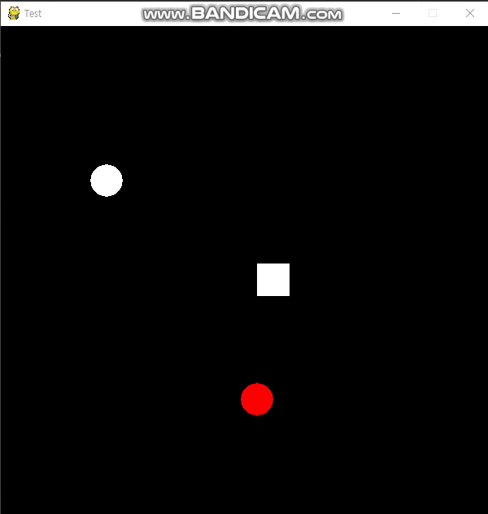

# 충돌하는 도형과 도형!

 + [충돌하는 도형과 도형!](../GamePrac/Prac5.py)
 
 <br>
 
 + 
 
 <br>
 
  + 간단하게 화면상의 원을 방향키를 사용하여 움직입니다.
 
```buildoutcfg
import random
import pygame
import sys
from pygame.locals import KEYDOWN, K_LEFT, K_RIGHT, K_UP, K_DOWN, QUIT, Rect
```

<br>

 + 파이게임, 시스템, 랜덤모듈을 가져옵니다. 그리고 방향키를 눌렀을 때 방향키를 사용하고 
 사각형을 그리기위해 Rect 기능을 가져옵니다. 그리고 창을 닫으면 게임이 종료되는 기능을 가져옵니다.
 
 <br>
 
 ```buildoutcfg
pygame.init()
WIDTH = 600
HEIGHT = 600
pygame.key.set_repeat(15, 15) #키보드키의 연속동작
SURFACE = pygame.display.set_mode((WIDTH,HEIGHT)) #화면의 크기
pygame.display.set_caption("Test") #게임의 이름정하기
FPSCLOCK = pygame.time.Clock() ##pygame의 프레임을 설정한다
```

<br>

 + pygame.init()는 파이게임의 초기화를 설정해줍니다. 반드시 필요한 코드입니다.
 그리고 WIDTH와 HEIGHT는 화면의 크기를 정해줍니다. 여기서
 'pygame.key.set_repeat'이 있는 데 이것은 키보드키를 꾹눌렀을때 계속 작동하게 해주는 코드입니다.
 
 <br>
 
 + 다음은 main함수에 대해서 알아봅시다.
 
 ```buildoutcfg
def main():
    pos_x = 30
    pos_y = 570
    x_pos = 600
    game_over =False
    y_pos = random.randint(50, 550) #사각형의 y좌표
    y1_pos = random.randint(50, 550) #circle의 y좌표
    while True:
        SURFACE.fill((0, 0, 0))
        if game_over == True:
            pygame.quit()
            sys.exit()
        for event in pygame.event.get():
            if event.type == QUIT:
                pygame.quit()
                sys.exit()
```
<br>

 + 각각의 변수에 초기값을 주고 game_over판정을 할수잇는 변수에 False값을 줍니다.
그리고 y_pos 와 y1_pos를 random.randint코드를 사용하여 무작위로 공과 사각형이 나오도록 해줍니다.
game_over 값이 True가 되면 파이게임과 시스템을 종료하도록 설정해줍니다.
그리고 파이게임의 이벤트속성을 가지고와서 QUIT를 지정해줍니다. 파이게임창을 닫을 시에 파이게임시스템이 종료됩니다.

<br>

```buildoutcfg
            elif event.type == KEYDOWN:
                if event.key == K_LEFT:
                    pos_x -= 10
                if event.key == K_RIGHT:
                    pos_x += 10
                if event.key == K_UP:
                    pos_y -= 10
                if event.key == K_DOWN:
                    pos_y += 10
```

<br>

 + 이벤트 타입이 키를 누르는 것일때, 방향키 이용하여 상하좌우 움직이게하고 그만큼의 좌표를 바꾸어줍니다.
 
 <br>
 
 ```buildoutcfg
            if pos_x < 20:
                pos_x = 20
            elif pos_x > 580:
                pos_x = 580
            if pos_y < 20:
                pos_y = 20
            elif pos_y > 580:
                pos_y = 580
```

<br>

 + 조정할 공이 화면밖으로 나가지 않도록 값을 설정해줍니다.
 
 <br>
 
 ```buildoutcfg
        x_pos -= 5
        if x_pos < 0:
            x_pos = 600
            y_pos = random.randint(50, 550)
            y1_pos = random.randint(50, 550)
            if abs(y_pos-y1_pos)<= 50:
                y_pos = random.randint(40, 560)
                y1_pos = random.randint(40, 560)
```

<br>

 + 반복문이 계속 진행되는 동안 x_pos의 값을 5씩 감소시켜줍니다. 그리고 0이하가 된다면 다시 600으로 보내주어
다시 지나가는 무한 반복을 시켜줍니다. 그리고 무작위로 y좌표를 지정하여 만약 원과 사각형이 겹쳐서 나오는 것을
방지하기위해서 abs()절대값으로 체크해줍니다.

<br>

```buildoutcfg
        if abs(pos_x - x_pos) <= 20 and abs(pos_y - y_pos) <= 30 :
            game_over = True
        elif abs(pos_x - x_pos) <= 20 and abs(pos_y - y1_pos) <= 30:
            game_over = True
```

<br>

 + 충돌여부의 핵심이라고 할수있습니다. 만약 조정하는공과 장애물들이 x좌표와 y좌표에 따라
 부딪힌다면 창이 닫히고 게임이 종료됩니다.
 
 <br>
 
 ```buildoutcfg
        rect = Rect(x_pos, y_pos, 40, 40)
        pygame.draw.rect(SURFACE, (255, 255, 255),rect)
        pygame.draw.circle(SURFACE,(255,0,0),(x_pos,y1_pos),20)
        pygame.draw.circle(SURFACE, (255, 255, 255), (pos_x, pos_y), 20)
        pygame.display.update()
        FPSCLOCK.tick(60)

if __name__ == "__main__":
    main()
```

<br>

+ 화면상에 도형들을 그리고 Run시에 main()함수를 불러 실행시킵니다.

<br>

### 기본기를 익혔으니 이제 무작위로 쏟아지는 장애물들을 키보드로 피하는 게임을 만들어 봅시다!
