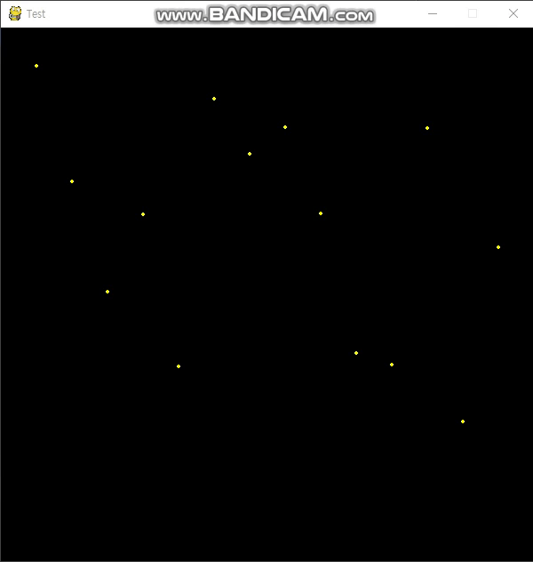
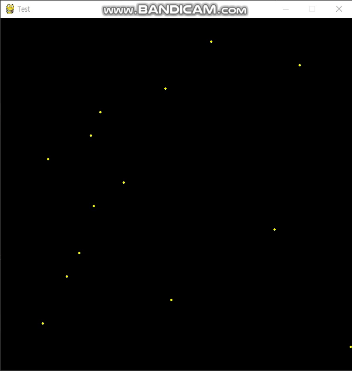

# 랜덤한 스피드 공 떨어뜨리기

+ ### [세로로 떨어져유](../GamePrac/Prac6.py)

<br>



<br>

+ ### [가로로 떨어져유](../GamePrac/Prac7.py)

<br>



## 세로코드를 기준으로 설명하겠습니다.

<br>

```buildoutcfg
import pygame
import sys
import random
from pygame.locals import QUIT
```

<br>

+ 기본모듈을 불러옵니다.

<br>

```buildoutcfg
WIDTH = 600
HEIGHT = 600
pygame.init()
pygame.display.set_caption("Test")
SURFACE = pygame.display.set_mode((WIDTH, HEIGHT))
FPSCLOCK = pygame.time.Clock()
```

<br>

+ 화면의 가로세로를 설정해주고 화면창을 생성하고 프레임을 받을 변수를 정해줍니다.

<br>

+ main 함수에 대해서 분석해보겠습니다.

```buildoutcfg
def main():
    Speedx = [1,10,20]
    posx = []
    posy = []
    for i in range(1,15):
        i *= 40
        posx.append(i)
    for j in range(1,15):
        j = 600
        posy.append(j)
```

<br>

+ Speed를 지정할 리스트 목록을 작성하고 x좌표와 y좌표를 저장받을 빈 리스트를 생성해 줍니다.

<br>

```buildoutcfg
    while True:
        SURFACE.fill((0, 0, 0))
        for event in pygame.event.get():
            if event.type == QUIT:
                pygame.quit()
                sys.exit()
```

<br>

+ 화면을 검은색으로 채우고 파이게임을 종료하는 코드를 입력해줍니다.

<br>

```buildoutcfg
        for i in range(len(posx)):
            rd_Speed = random.choice(Speedx)
            posy[i] += rd_Speed
            pygame.draw.circle(SURFACE, (255, 255, 0), (posx[i], posy[i]), 2)
            if posy[i] > 600:
                posy[i] = 0
```

<br>

+ posx리스트의 수만큼 공을 그립니다. 그리고 스피드는 Speed리스트에서 랜덤으로 선택하여 y좌표를 이동시킵니다.
그리고 만약 y의 좌표가 600을 넘어가면 다시 처음부터 시작하도록 해줍니다.

<br>

```buildoutcfg
        pygame.display.update()
        FPSCLOCK.tick(30)

if __name__ == "__main__":
    main()
```

<br>

+ 화면창에 코드짠것들을 표시해주고 프레임을 30으로 정해줍니다. 그리고 실행 시킵니다.


+ ### 지금까지 세로로 떨어지는 코드를 보았습니다. 그러나 가로로 통과하는 코드 또한 다를 것이 없습니다. 코드파일을 참고하여 실습하여 봅시다.